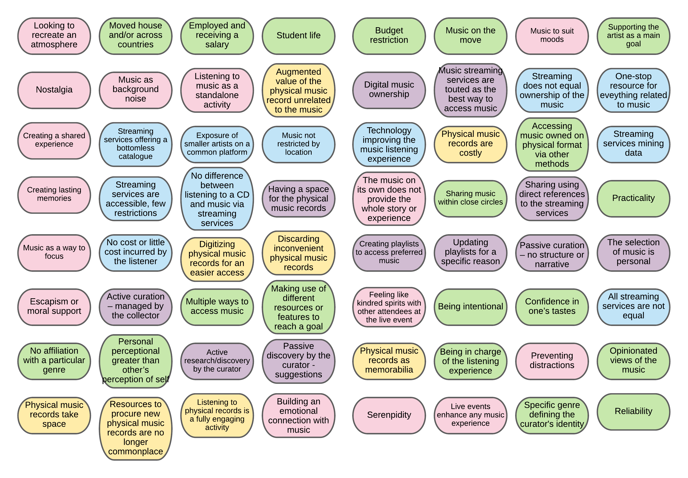

## Progress so far

Based on the codes I've listed during my first pass over the transcripts, I am currently abstracting themes and going through the focused coding step (or axial coding step). 

Once that is finished, I will be assembling the different themes identified in thematic networks. Some themes emerged that I didn't expect, which is great, and I am eager to structure them in distinct categories to get a better idea of the body of my dissertation.
I am trying to list all decisions and codes in a clear way to be able to keep a consistent approach and access the relevant transcripts segments easily.

