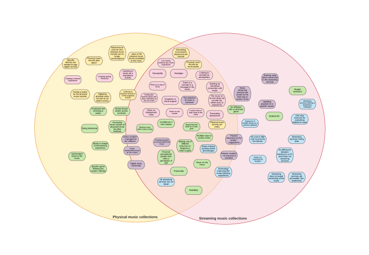

## Thematic analysis using visualisations 

Over the past few weeks, I have learned to use LucidChart, a very powerful visualisation tool. I used differents charts as well to help me figure out how to visualize my data, it took me a little while.

I did find insights relevant to only one or two interview but I try to bring them as a nice contrast to the expressed thoughts or opinions of the majority. 

Regarding the dissertation, I have been trying to put on paper a 'stream of consciousness' while looking over the thematic maps; my goal is to piece together what I have then into a palatable narrative, however I still feel like I am putting together the building blocks.
